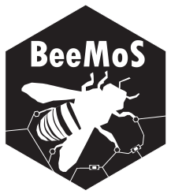
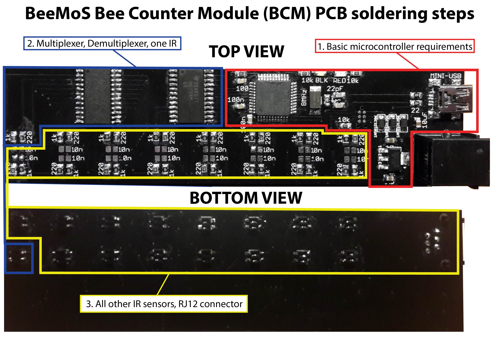
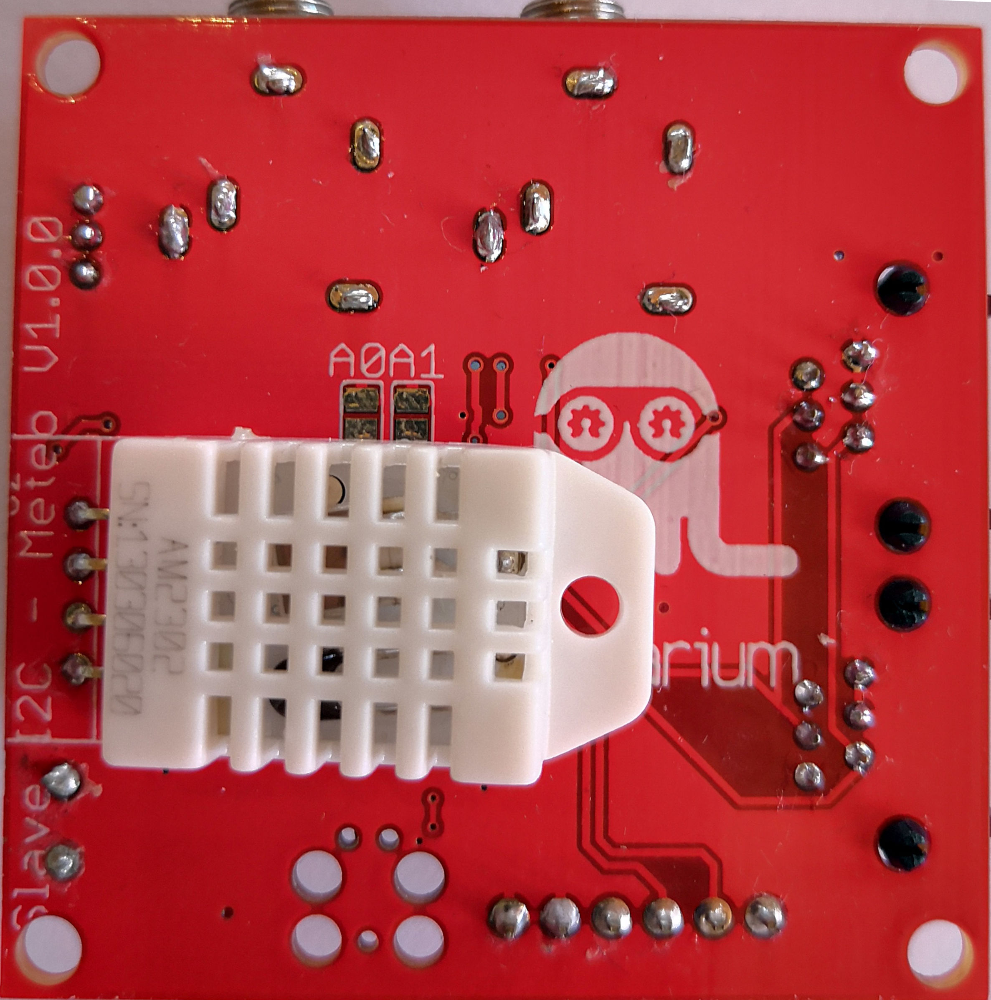
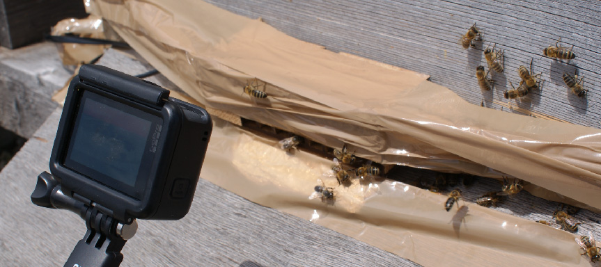

  

# BeeMoS - Système de monitorage d'abeilles  (En développement)

*[Read this in english](README.md)*

Le projet BeeMos est un système de monitorage de ruches développé au laboratoire d'open science Hackuarium, Route de Crochy 20, Ecublens, Suisse.

# Objectifs 
Construire et programmer un système open source de monitorage d'abeilles avec les objectifs suivants:

- [x] Suivre l'activité des ruches pour étudier le comportement des abeilles et surveiller leur santé.
- [X] Détecter les changements instantanés et progressifs dans le poids de la ruche au cours du temps (essaimage, production de miel, ...).
- [X] Mesurer des variables environnementales dont l'humidité, la température, la lumière et la pression atmosphèrique pour comprendre leur effet sur les abeilles.
- [ ] Envoyer les données à un serveur à distance pour les analyser, visualiser et avertir l'utilisateur si quelque chose d'anormal se produit.

# Modules
Pour parvenir aux objectifs ci-dessus, le projet est subdivisé en plusieurs modules:

**Compteur**: Compte les abeilles qui entrent et sortent de la ruche au cours du temps en utilisant des capteurs infrarouge. [_(Détails techniques_)](counter-i2c/README.md)

  

**Balance**: Pèse la ruche périodiquement en utilisant 4 cellules de charge.

**Station météo**: Enregistre la température, l'humidité, la luminosité et la pression atmosphérique à l'extérieur des ruches. [_(Détails techniques)_](weather-i2c/README.md)

  
  

**Carte maître**: Communique avec tous les autres appareils par I2C et envoie les données de la ruche à un serveur à distance. La communication à distance sera effectuée par un module à carte SIM. Mesure aussi la température et l'humidité à l'intérieur de la ruche. [_(Détails techniques)_](master-simple/README.md)

# Etat du projet
Nous avons conçu, commandé et recu les circuits imprimés pour le compteur d'abeilles, la station météo, la balance et la carte maître. Tous les éléments de ces cartes sont désormais soudés. Les codes Arduino des différentes cartes ont été écrits et les cartes programmées, notamment pour compter les abeilles qui entrent et sortent de la ruche et les enregistrer pour toutes les portes en utilisant du multithreading. En utilisant une découpeuse laser, nous avons aussi construit un boîtier en bois (MDF 3mm) qui sert à contenir le circuit imprimé du compteur d'abeilles. Ce boîtier comprend 8 portes individuelles que les abeilles peuvent emprunter pour transiter entre l'intérieur et l'extérieur de la ruche. Nous avons effectué quelques essais sur le terrain pour évaluer la précision du compteur mais nous devons encore effectuer quelques calibrations physiques et logicielles pour le faire fonctionner correctement. En effet, nous avons remarqué qu'il y avait de faux positifs en début et en fin de journées ensoleillées (il est possible que les rayons du soleil à ces moments font croire au compteur qu'une abeille passe alors qu'il n'y en a pas).
Etant donné que le réseau 2G va bientôt disparaître de Suisse, le module SIM800L ne pourra pas fonctionner. Nous sommes en train de considérer de migrer notre carte maître sur un ESP32 afin d'être moins limités dans sa programmation (plus de mémoire disponible que pour les cartes basées sur l'Atmega32u4). De plus, l'ESP32 a le WiFi et Bluetooth intégrés et la possibilité d'utiliser LoRa assez facilement pour les communications sans fil. Etant donné que nos autres cartes sont basées sur le protocole I2C, elles devraient pouvoir être utilisées avec la nouvelle carte facilement.

  

La station météo peut maintenant afficher la température, l'humidité, la pression atmosphérique et la luminosité relative. 
La prochaine étape sera de faire fonctionner et calibrer le compteur d'abeilles ainsi que de s'assurer de la stabilité de la balance au fil du temps. 

# Ressources additionnelles 

Tous les codes, spécifications et schémas des circuits imprimés ainsi que la documentation sont disponibles sur le [répertoire github BeeMoS](https://github.com/Hackuarium/beemos) (uniquement en anglais)

Voir ce projet sur [CADLAB.io](https://cadlab.io/project/1029)
