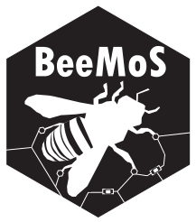
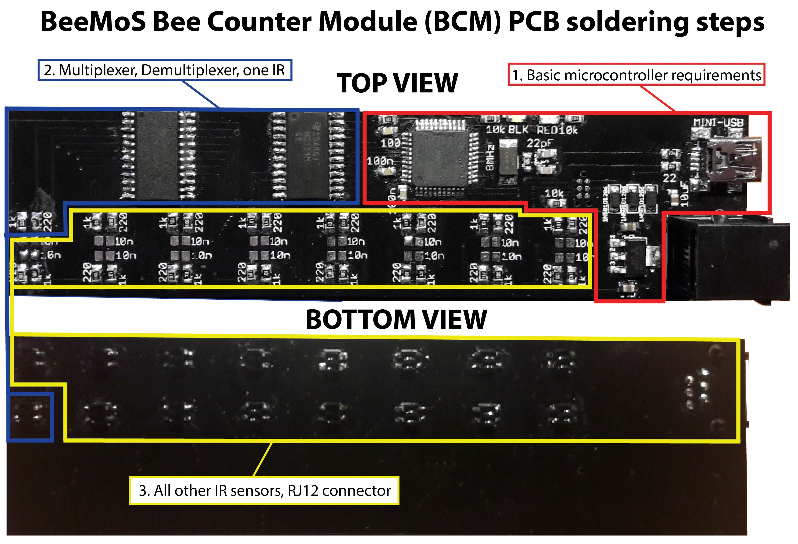
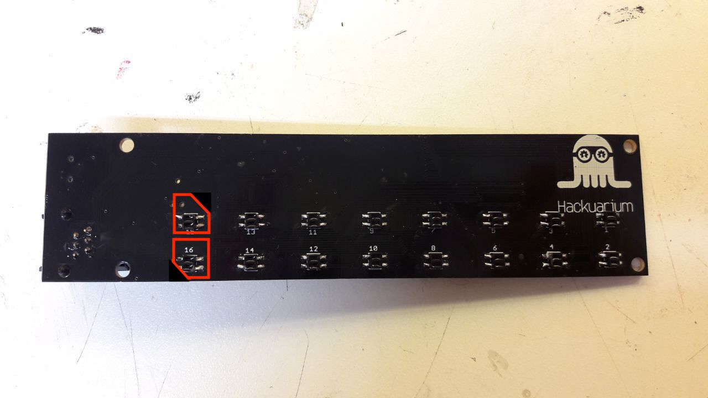
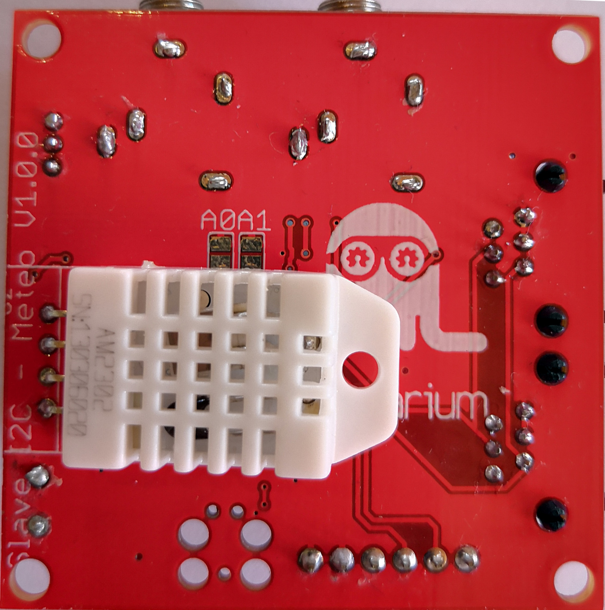
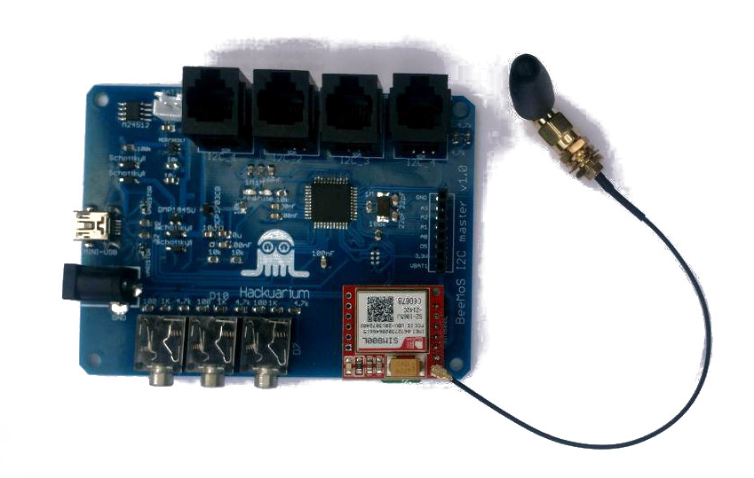
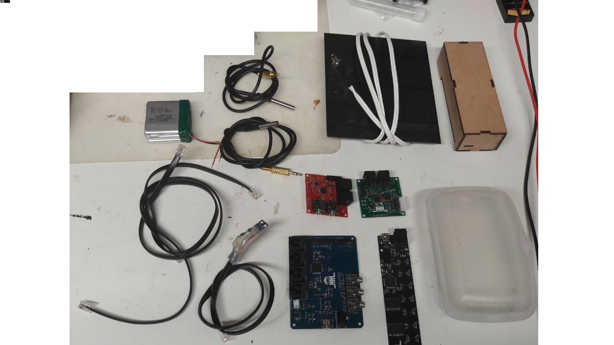

  

# BeeMoS - honey Bee Monitoring System  (under development)

_[Lire en français](README.fr.md)_

The BeeMoS project is an open source bee hive monitoring system developed at the open science lab [Hackuarium](http://www.hackuarium.ch), Route de Crochy 20, Ecublens, Switzerland.

Please fee free to [contact us](https://form.jotformeu.com/71600609780354) if you would like more information.

# Objectives

Build and program an open source bee monitoring system capable of the following objectives:

- [x] Track the activity of the hives to study the behaviour of bees and monitor their health.
- [x] Track changes in the hive's weight over time to detect sudden and gradual changes (swarming, honey production ...).
- [x] Measures environmental variables including temperature, humidity, light and atmospheric pressure and study their effect on the bees.
- [ ] Send the data to a remote server for analysis, visualization or to notify the user if something unusual happens.

# Cloning the project

This project uses SUBMODULES

In order to clone use:

`git clone --recurse-submodules https://github.com/hackuarium/beemos`

To update the submodules

`git submodule update --recursive --remote`

# Modules

To achieve the above objectives, the project follows a modular design with different hardware components.

[**Counter**](counter-i2c/README.md): Counts bees entering and exiting the hive over time using infrared sensors.

  

Here is the orientation of the IR sensors at the back of the PCB. Be careful, the orientation of the Eagle file is seen from the top of the PCB.

  

[**Scale**](scale-i2c/README.md): Weighs the hive periodically using 4 load cells in Wheatstone bridge configuration.

[**Weather station**](weather-i2c/README.md): Monitors temperature, humidity, atmospheric pressure and luminosity outside of the hives.

  
  

[**Master board**](master/README.md): Communicates with all other devices over I2C, log data in memory and sends the data to a remote server using a SIM card module. May also track temperature inside the hive.

  

[**Simple master**](master-simple/README.md): A simple master board with I2C RJ-12 socket to
make some tests.

# State of the project

We have designed and ordered PCBs for the bee counter, weather station, scale and master boards. These four boards have been assembled and programmed. We also built a laser cut wooden enclosure which contains the bee counter PCB. It includes 8 individual gates that the bees use to enter/exit the hive and an upper compartment for the board so that sensor are on top of entering bees. A few field trials were launched to assess the accuracy of the bee counter but we still need to fix some things in the hardware and software to get it working (we detect false positives at the beginning and the end of sunny days, possibly due to sun beams entering and being counted as a passing bee). Clara has joined the BeeMoS team in the summer of 2018 to make some tests of the bee counter in a controlled setting with live bees (transparent box with the beecounter inside and a camera to record video of entering/exiting bees that was compared to the readings from the board) and also participated in building a hive scale. 

  

The weather board can now show temperature, humidity, atmospheric pressure and relative light intensity. The scale board v1.0 has been soldered, a minor fix was needed to get it to work. The next steps will be to get the bee counter to work accurately by performing controlled tests, to assess the accuracy of the scale over time and to be able to send data wirelessly, integrate them to a database and plot them in an attractive way. 

We have assembled a complete kit, containing:
- 1 master board
- 1 counter board
- 1 scale board
- 1 weather board (to be protected from rain in a transparent container that lets the light through as well as an entry for the humidity to be accurately measured)
- 1 Si7021 humidity sensor
- 1 solar panel
- 2 temperature sensors (one wire DS18B20)
- 3 cables (RJ11 connectors)
- 1 battery 3.7V, 6600mA/h
- 1 wooden counter box
- 1 plastic box (to protect the master and scale boards from rain)
Here is what the kit actually looks like:

  

We already have assembled and tested some parts of it (the master, weight and weather boards in particular), but on an empty hive. The master board seems to log correctly and we are able to read the logs afterwards. Some things need to be fixed, for example sometimes the master board stops recording for long periods of time. It seems that this happens when the cables between boards (I2C interface) are too long. Since the 2G network will soon disappear in Switzerland, the SIM800L module will become useless (does not work with 3G and above). We are now considering to design a new master board based on the ESP32 in order to be less limited in programming it (less memory limitations than for Atmega32u4-based boards) and also to have integrated WiFi and Bluetooth and possibly LoRa too for wireless communications. Since all the other boards are based on I2C communication, they should be easy to integrate with the new master board.

# Further resources

All codes, PCB board and schematic files and documentation can be found on the [BeeMoS github repository](https://github.com/Hackuarium/beemos) (in english only)

View this project on [CADLAB.io](https://cadlab.io/project/1029)
