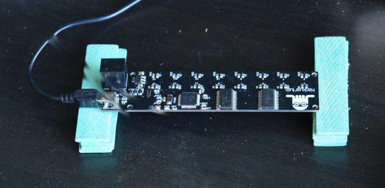

Bee-counter i2c

<p align="right">
<a href="https://hackuarium.github.io/beemos/">

</a>
</p>

# Bee-counter i2c

Using an Arduino based microcontroller, infrared (= IR) reflectance sensors are used to detect if a bee is present under the sensor, thereby modifying the reflected IR signal read by the microcontroller. Each gate consists of two IR reflectance sensors, each capable of emitting and receiving an IR signal. This allows to determine whether the bee is entering or exiting the hive by looking at which of the two sensors reacted first to the presence of the bee below it.

## Components

- x1 Microprocessor Atmel 32u4 (similar to Arduino Leonardo boards), 8Mhz, 3.3V
- x16 QRE1113 IR reflectance sensors (x2 per gate)
- x1 74HC154W demultiplexer used to switch on the IR led of one of the 16 IR reflectance sensors
- x1 74HC4067 multiplexer used to read the value from one of the IR reflectance sensors (the one which has the IR led on)

## Performances

Scanning all 16 IR sensors: 3ms
Current consumption: 27mA

## The box

The box consists in a laser cut wooden enclosure, which contains the bee counter PCB. It includes 8 individual gates that the bees use to enter/exit the hive and an upper compartment for the board so that sensor are on top of entering bees.

## Parameters

There are 26 parameters:

| ID  | Name                   | Description                                                                          |
| --- | ---------------------- | ------------------------------------------------------------------------------------ |
| 0   | PARAM_LOGID            | the log ID                                                                           |
| 1   | PARAM_SECONDS          | the number of seconds since the last log                                             |
| 2   | PARAM_GATE1_IN         | gate 1 counter of events IN                                                          |
| 3   | PARAM_GATE1_OUT        | gate 1 counter of events OUT                                                         |
| 4   | PARAM_GATE2_IN         | gate 2 counter of events IN                                                          |
| 5   | PARAM_GATE2_OUT        | gate 2 counter of events OUT                                                         |
| 6   | PARAM_GATE3_IN         | gate 3 counter of events IN                                                          |
| 7   | PARAM_GATE3_OUT        | gate 3 counter of events OUT                                                         |
| 8   | PARAM_GATE4_IN         | gate 4 counter of events IN                                                          |
| 9   | PARAM_GATE4_OUT        | gate 4 counter of events OUT                                                         |
| 10  | PARAM_GATE5_IN         | gate 5 counter of events IN                                                          |
| 11  | PARAM_GATE5_OUT        | gate 5 counter of events OUT                                                         |
| 12  | PARAM_GATE6_IN         | gate 6 counter of events IN                                                          |
| 13  | PARAM_GATE6_OUT        | gate 6 counter of events OUT                                                         |
| 14  | PARAM_GATE7_IN         | gate 7 counter of events IN                                                          |
| 15  | PARAM_GATE7_OUT        | gate 7 counter of events OUT                                                         |
| 16  | PARAM_GATE8_IN         | gate 8 counter of events IN                                                          |
| 17  | PARAM_GATE8_OUT        | gate 8 counter of events OUT                                                         |
| 20  | PARAM_THRESHOLD        | the threshold of absorbance to reach to conclude there is a bee crossing the gate    |
| 21  | PARAM_THRESHOLD_RESET  | the threshold of absorbance to conclude that the event is finished                   |
| 22  | PARAM_DEBUG_REPEAT     | the duration of the gate debug monitoring                                            |
| 23  | PARAM_DEBUG_DELAY      | the delay between two successive displays of debug information                       |
| 24  | PARAM_LOGGING_INTERVAL | the time interval between two logs (should be at least 300s)                         |
| 25  | PARAM_DEBUG_PRINT      | a boolean to enable the debug mode. `Z1` allows to enable debug, `Z0` to disable it. |

## Menu and commands

Here is the actual menu, accessible by typing "h" + enter.

- (h)elp
- (s)ettings
- (u)tilities
- (b)ackground
- (c)ounter
- (g)ate debug bg
- (l)og

`Settings` gives access to the current values of the settings. To change the value of a setting, just type the letter of the setting (A-Z) and the new value of the setting in the chat box and press enter.
`Gate debug mode` activates the real-time monitoring system. Each time a bee pass through a tunnel, the time, the number of the gate, the absorbance values of the two sensors and the number of bees outside is displayed.

## When do we have an event ?

The system will calculate the background which is the value of the receiver when no bee is in the gate.
In order to evaluate this background, the last 15 values of each detector and the background will
be the median of those values.

An event will start when the change observe to a detector is larger than `PARAM_THRESHOLD`. This event
will finish when this value will go under ``PARAM_THRESHOLD_RESET`.

In order to well detect an event it would make sense that the value of ** the background is between
96 and 160 **. A low value means that the receiver receives too much IR. We could ensure that the voltage
is really 3.3v and if it is the case we could think about a high resistor value for the IR led.

You can easily check the background values using the option `b`.

## Gate validation

In order to validate the board it is practical to use a Q-tip and to use the `gate debug bg`
menu item (`g`).

This mode will check for absolute value variation compared to the background value.
If this variation is over the `PARAM_THRESHOLD` the value will be displayed. The measurements are done
and display the value`PARAM_DEBUG_REPEAT` times and separated by `PARAM_DEBUG_DELAY` (500, which means 500 ms,
is a good value).

With a Q-tip we should detect a variation for the "in" and "out" detector of each gate.

In the following logs we can see that the Gate 1 and 3 have problems because both event are not detected.

```
Gate 1 - Inside: 2  - Outside: 39
Gate 1 - Inside: 3  - Outside: 38
Gate 1 - Inside: 3  - Outside: 33
Gate 1 - Inside: 0  - Outside: 13
Gate 1 - Inside: 1  - Outside: 24
Gate 1 - Inside: 3  - Outside: 36
Gate 1 - Inside: 3  - Outside: 38
Gate 1 - Inside: 0  - Outside: 17
Gate 2 - Inside: 1  - Outside: 5
Gate 2 - Inside: 11 - Outside: 12
Gate 2 - Inside: 13 - Outside: 11
Gate 2 - Inside: 14 - Outside: 11
Gate 2 - Inside: 14 - Outside: 11
Gate 2 - Inside: 12 - Outside: 12
Gate 3 - Inside: 11 - Outside: 2
Gate 3 - Inside: 10 - Outside: 2
Gate 3 - Inside: 10 - Outside: 1
Gate 3 - Inside: 10 - Outside: 2
Gate 4 - Inside: 7  - Outside: 12
Gate 4 - Inside: 6  - Outside: 10
Gate 4 - Inside: 6  - Outside: 11
Gate 4 - Inside: 8  - Outside: 11
Gate 4 - Inside: 2  - Outside: 7
```

## Studying the background

Conditions:

- power supply is USB
- convert is MCP1703-50 !!! (5v) so the voltage should be close to 4.7 !

We did various tests to get the average value depending the surface and the distance. In order
to make the measurement we use a very simple setup in which we control the distance between the
PCB and the surface.



| Surface     | Distance [mm] | Value | SD    |
| ----------- | ------------- | ----- | ----- |
| Black wood  | 2             | 199   | 14.40 |
| Black wood  | 4             | 243   | 1.86  |
| Black wood  | 6             | 249   | 3.48  |
| Black wood  | 8             | 251   | 5.43  |
| MDF         | 2             | 19    | 0.00  |
| MDF         | 4             | 23    | 8.96  |
| MDF         | 5             | 84    | 25.91 |
| MDF         | 6             | 134   | 16.23 |
| MDF         | 8             | 174   | 14.01 |
| White paper | 2             | 19    | 0.00  |
| White paper | 4             | 28    | 7.75  |
| White paper | 5             | 99    | 12.15 |
| White paper | 6             | 147   | 10.70 |
| White paper | 8             | 195   | 9.72  |

We observe that it is barely possible to measure anything on black surface. MDF or white
paper is ok but the distance is critical.

The analysis of the background log (obtained with `b`) can be processed [online on this webpage](https://www.cheminfo.org/?viewURL=https%3A%2F%2Fcouch.cheminfo.org%2Fcheminfo-public%2F608afa37a31ea499b118ba1d74ee5f8c%2Fview.json&loadversion=true&fillsearch=Beemos+background+analysis).

What we observe is that when we have around 5mm the SD is huge. Nevertherless as shown with the values the stability is really good.

We find here the 16 detectors with for each of them 15 values in hexadecimal that corresponds
to the A/D convertion of the received signal. The acquisition is done every second during
15 seconds. The last value (in decimal), used for the statistics,
is the median of the 15 other values.

```
0 30 30 30 30 30 30 30 30 30 30 30 30 30 30 30 48
1 35 35 35 35 35 35 35 35 35 35 35 35 35 35 35 53
2 76 76 76 76 76 76 76 76 76 76 76 76 76 76 76 118
3 4F 50 4F 4F 50 4F 50 4F 4F 4F 4F 50 4F 4F 50 79
4 7B 7A 7A 7A 7A 7A 7A 7A 7A 7A 7A 7A 7A 7B 7A 122
5 45 45 46 45 45 45 45 45 45 45 45 45 45 45 45 69
6 76 76 76 76 76 76 76 76 76 76 76 76 76 76 76 118
7 54 54 54 54 54 54 54 54 54 54 54 54 54 54 54 84
8 84 84 83 83 84 83 84 83 83 83 84 83 84 84 83 131
9 4E 4F 4F 4F 4F 4E 4F 4E 4F 4F 4F 4E 4F 4F 4E 79
10 76 76 76 76 76 76 76 76 75 76 76 76 76 76 76 118
11 52 52 52 52 52 52 52 52 52 52 52 52 52 52 52 82
12 74 74 74 74 74 74 74 74 74 75 74 74 74 75 74 116
13 57 58 57 58 57 57 58 57 57 57 58 57 57 57 57 87
14 6F 6F 6F 6F 6F 6F 6F 6F 6F 6F 6F 6F 6F 6F 6F 111
15 4E 4E 4E 4E 4E 4E 4E 4E 4E 4E 4E 4E 4E 4E 4E 78
```

## Experiments

In order to assume the precision of the bee counter, we set an experiment as follows:
We built inside a transparent tupperware two hermetic compartiments, one with sugared water, the other one with pollen. The bees can only pass from one compartment to another through the box containing the tunnels with the IR reflectance sensors. With a camera, we filmed the tupperware to then compare the results of the gate monitoring debug system with the footage of the camera.


## Results

The monitoring system seems to be functional. Every bee passing through is counted and in the right sense (IN or OUT).
There is still some problems yet to be fixed:

- The bees have the tendency to poke their head through the tunnel without crossing it, thus triggering the sensors even when they don't cross the box. One possible solution to be tested is to extend a little the length of the tunnel.
- As the sensors are placed on one side of the box, they are easily triggered by quick changes in brightness (for example a hand moving over the tupperware). This problem should be solved when the box will be placed inside a hive, because the side with the sensors will be facing the inside of the hive, thus preventing such rapid changes.
