

# Scale

The purpose of this board is to measure the weight of the hive periodically. This allows to detect honey production and swarming. It is an I2C slave that includes a HX711 for weight measurement.

## Hardware components

The following components are present on the board:

Microcontroller: ATmega328

Sensors:

- HX711 Amplifier
- 4X load sensors SEN-10245 (confirm REF)

Connectors:

- 2X RJ12 to connect other boards via I2C

## Programming

After soldering the device you need to add a bootloader.
This device is based on an ATmega328 at 8MHz (3.3v). It is compatible
with an Arduino Fio.

To install the bootloader we are using as cable the tag-connect as well as
a TinyISP module.

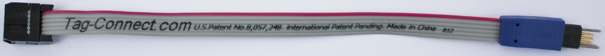

Once the bootloader has been flashed you may program using a serial
adaptator like the FT232RL.

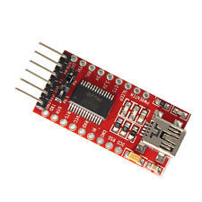

## I2C registers

This device appears like a I2C slave at the address **16** and allows the following commands

| Register address | Description                    | R/W |
| ---------------- | ------------------------------ | --- |
| 0: A             | Log ID                         | R   |
| 1: B             | Seconds since last log         | R   |
| 2: C             | Weight (internal unit)         | R   |
| 3: D             | Weight (g)                     | R   |
| 4: E             | Offset (internal unit)         | R   |
| 5: F             | Factor (internal unit)         | R   |
| 6: G             | Minimal weight (internal unit) | R   |
| 7: H             | Maximal weight (internal unit) | R   |
| 8: I             | Reference value (in 10g unit)  | R   |
| 9: J             | Weight (mg) (LOW bits)         | R   |
| 10: K            | Weight (mg) (HIGH bits)        | R   |
| 13: N            | Power supply (in mV)           | R   |
| 14: O            | Logging interval               | R/W |
| 15: P            | Delay before going to sleep    | R/W |

### Actions

Those actions allows to calibrate the scale. Please take care that you need to weight
at least 5s so that the scale stabilize.

| Register address | Description                            | R/W |
| ---------------- | -------------------------------------- | --- |
| 52: BA           | Define empty level                     | W   |
| 53: BB           | Define the weight one kg over the tare | W   |
| 54: BC           | Define low level                       | W   |
| 55: BD           | Define high level                      | W   |

### Reference

Before the reference used to be 1kg. A more flexible system had to be
setup in order to deal with small quantities (less than 100g) as well
as large quantities (over 10kg). Therefore the parameter `I` allows to
specifiy the weight of the reference used during calibration.
This value is expressed in decagram (unit of 10g). By default it is
100 (the reference by default is 1kg).

## Performances

- Consumption in sleep mode:
- Consumption awake:

## Making

Wiring the 4 load cells in Wheatstone bridge configuration:

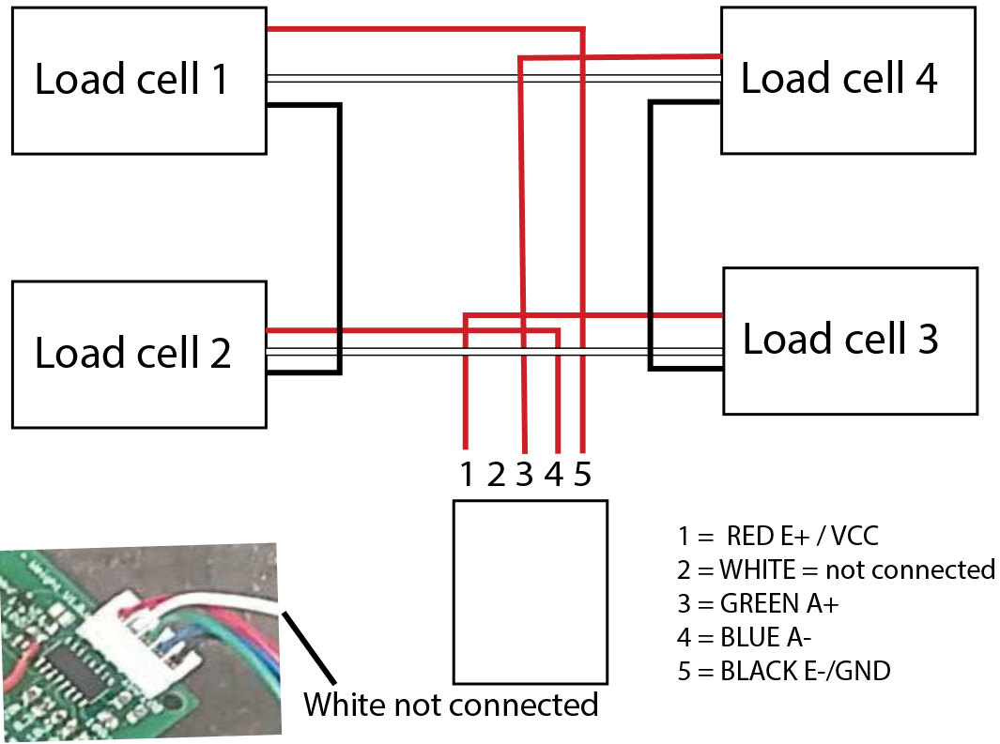

Version 1.0.0 has 2 small bugs:

- small cable has to be soldered as show in the following picture
- the resistor in the red circle should be 220k instead of 1m (fix out of bound A/D converter scale)

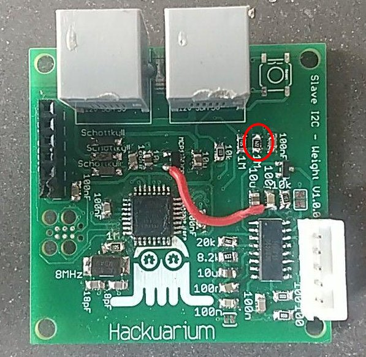

If you want to solder a loading cell you may use the following color cabling

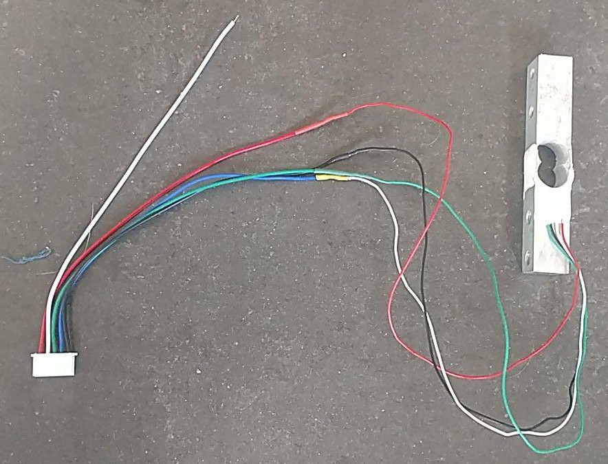

Final global view:

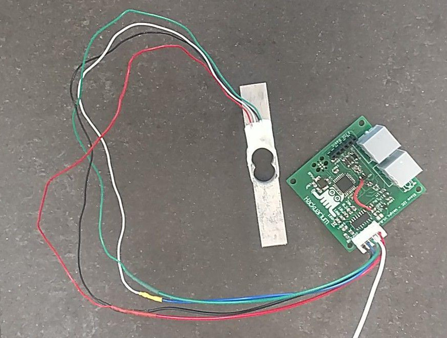

## Creation of the stand

To create a base for the load cells, we assembled two wood boards together and glued the load cells between them. We carved a hole under each load cell to allow them to be pressed. On the first scale metallic hinges were added to fix the two boards together. On the second and third scales, wooden pins were fixed on the underboard and complementary holes were created in the upperboard. In both cases, the scale can still be dismantled and movement is permitted in the vertical direction. A rectangular hole was made in the center of the boards because as the bees go in and out of the hive, wax and pollen can fall from them and must not build up on the boards.
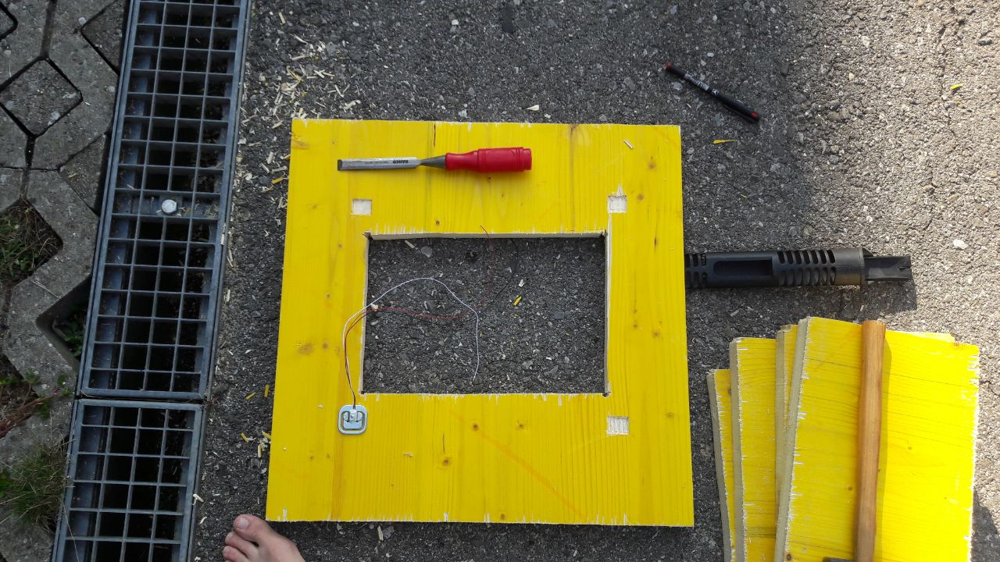

Here is the inside of the first scale built:
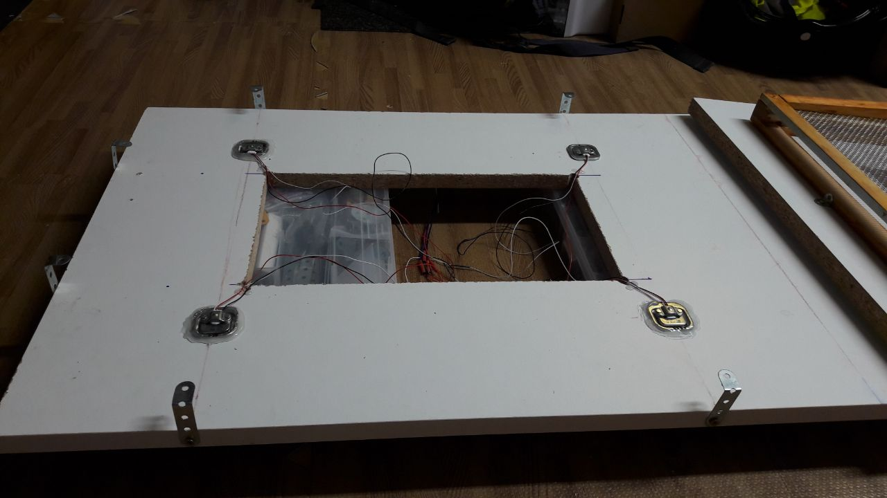

The inside of the second scale:
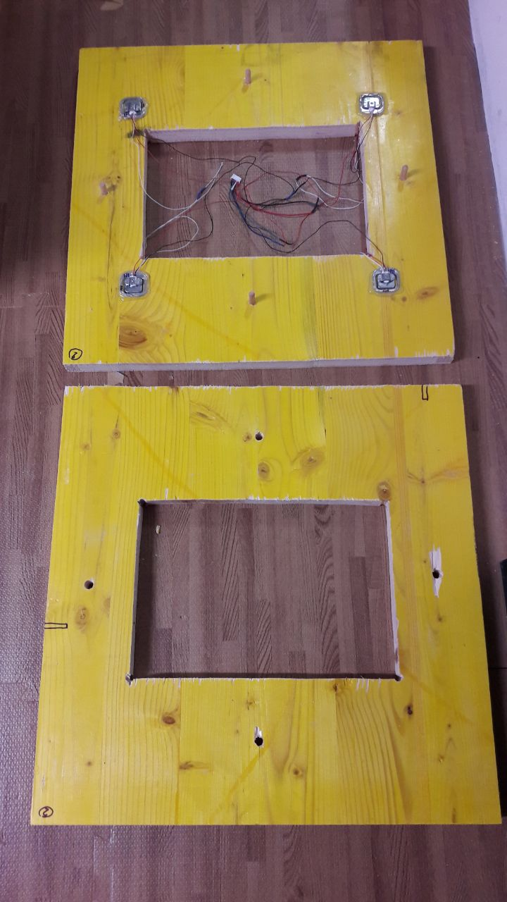

What it looks like assembled:
The wooden piece with the fence is the base of the hive.
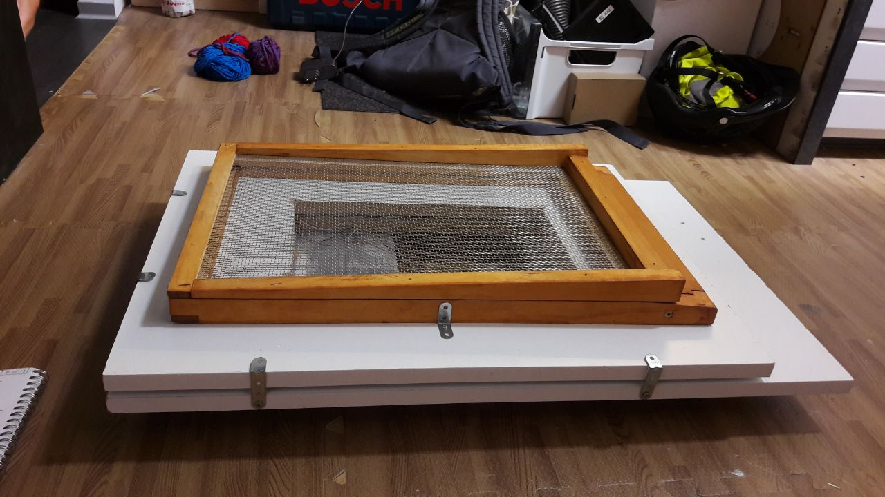
.
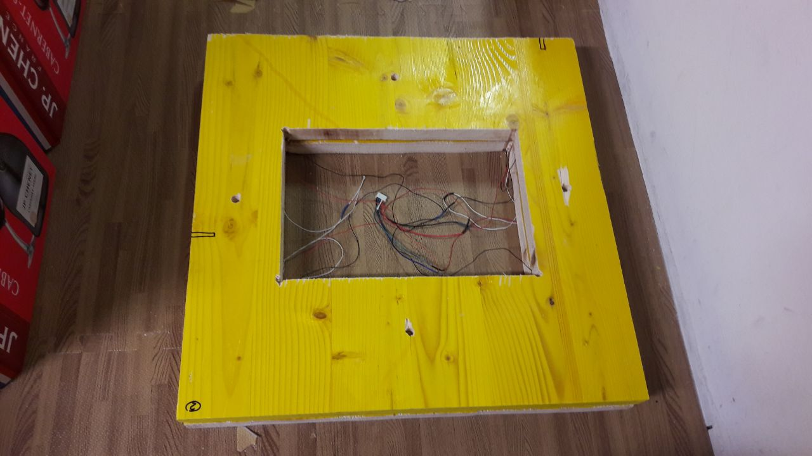

We then tested if the weight was correctly measured by calibrating the scale with 1L of milk, and then adding more and more cartons of milk. The results were encouraging, but we tested only up to 15kg. Next steps will be to test with a complete hive and to test the stability of the measurement as time goes by.
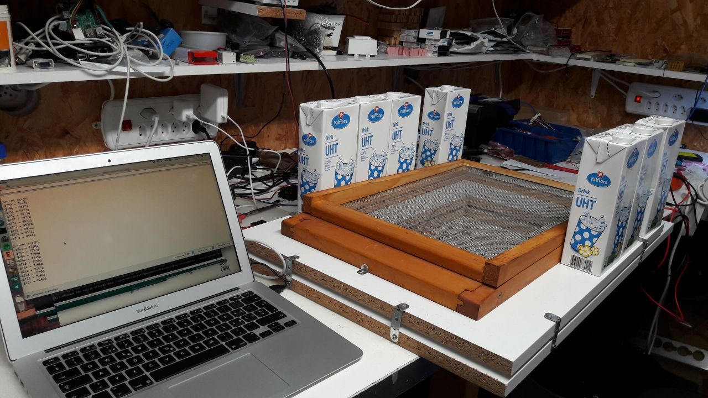

To date, we built three full scales that seems to be working.
